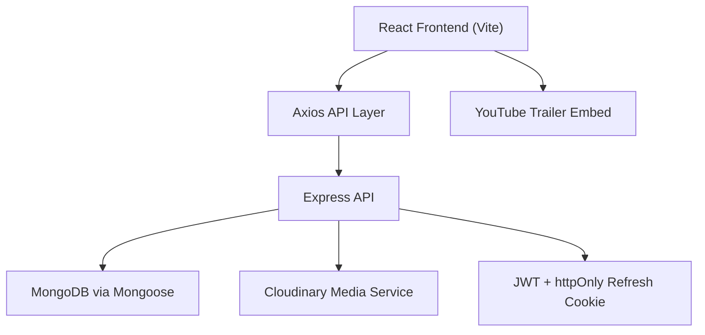
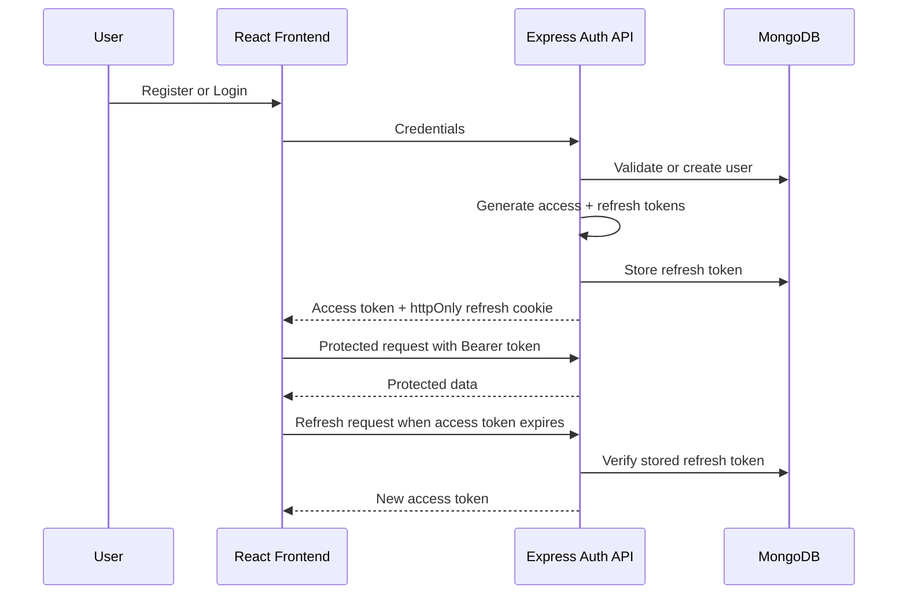

# StreamFlix


StreamFlix is a full-stack MERN movie platform built for browsing curated films, managing watchlists, reviewing movies, tracking viewing activity, and administering a movie catalog. It combines a responsive React frontend with a secure Express API, MongoDB persistence, Cloudinary media uploads, role-based admin controls, and a content-based recommendation engine.

---

## Features

### Authentication & Security

- JWT authentication with short-lived access tokens
- Refresh token flow using httpOnly cookies
- Protected frontend routes for authenticated users
- Role-based access control for admin-only APIs and pages
- Password validation during registration
- Password hashing with bcrypt
- Auth and upload rate limiting
- Helmet security headers and CSP configuration

### Movie Platform

- Browse paginated movie catalog
- Search by text with genre and year filters
- Genre-based movie browsing
- Trending movies based on view count
- Movie detail pages with poster, backdrop, metadata, cast, and recent reviews
- YouTube trailer playback using stored `youtubeId`
- Reviews and 1-10 ratings
- Watchlist add/remove flow

### User Features

- Profile management
- Avatar upload and replacement
- Dashboard analytics
- Watch history with progress tracking
- Like and dislike toggles
- Personalized recommendations based on preferences and activity

### Admin Features

- Movie management: create, update, and delete catalog entries
- User management: list users, promote/demote roles, delete users
- Analytics dashboard for users, movies, reviews, watchlists, genres, signups, and top movies
- Cloudinary media management for movie posters, banners, trailers, and avatars
- Cleanup of Cloudinary assets when media or users are removed

### Engineering Features

- Error boundaries on the frontend
- Global Express error handling
- Axios interceptors with automatic token refresh
- Loading states, empty states, and reusable UI primitives
- Responsive layouts with Tailwind/CSS
- Request validation using `express-validator`
- Centralized API service layer

---

## Tech Stack

| Layer | Technologies |
| --- | --- |
| Frontend | React, Vite, Axios, React Router, Motion / Framer Motion API, Recharts, Tailwind CSS / CSS |
| Backend | Node.js, Express, MongoDB, Mongoose, JWT, bcryptjs |
| Services | Cloudinary |
| Security & Middleware | Helmet, CORS, Cookie Parser, Morgan, Express Rate Limit, Multer |

---

## Project Structure

```txt
Stream-Flix/
├── backend/
│   ├── config/          # Database, environment, and Cloudinary configuration
│   ├── controllers/     # Request handlers for auth, movies, users, reviews, admin, uploads
│   ├── middleware/      # Auth, validation, rate limiting, multer, async and error handling
│   ├── models/          # Mongoose schemas
│   ├── routes/          # Express route definitions
│   ├── seed/            # Movie and admin seed scripts
│   ├── services/        # Cloudinary and recommendation logic
│   ├── validators/      # express-validator rule sets
│   └── server.js        # Express application entry point
├── frontend/
│   ├── components/      # Reusable UI and feature components
│   ├── context/         # Auth, theme, toast, and watchlist state
│   ├── pages/           # Route-level React pages
│   ├── routes/          # Client-side route configuration
│   ├── services/        # Axios-backed API modules
│   ├── styles/          # Global and theme CSS
│   └── utils/           # Client helpers and validators
├── dist/                # Production build output
├── index.html
├── vite.config.js
└── package.json
```

---

## Architecture Overview

StreamFlix is organized as a client-server MERN application.

- **Frontend layer:** React pages, reusable UI components, contexts, protected routes, and service modules under `frontend/`.
- **Backend layer:** Express routes, controllers, middleware, validators, and service logic under `backend/`.
- **Database layer:** MongoDB collections managed through Mongoose models.
- **External services:** Cloudinary stores uploaded images and videos; YouTube embeds trailers through stored video IDs.



---

## Authentication Flow

1. A user registers with name, email, password, and optional genre preferences.
2. The backend validates input, hashes the password, creates the user, and returns an access token.
3. A refresh token is stored in the database and sent as an httpOnly cookie.
4. Login rotates the refresh token and returns a new access token.
5. The frontend stores the access token in memory and attaches it to API requests.
6. On expired access tokens, the Axios interceptor calls `/api/auth/refresh` and retries the failed request.
7. Protected routes use auth state from `AuthContext`; admin routes also require the `admin` role.



---

## Database Design

| Model | Purpose |
| --- | --- |
| `User` | Stores account details, role, avatar, preferences, watch history, liked movies, disliked movies, and refresh token. |
| `Movie` | Stores catalog metadata, poster/backdrop assets, YouTube trailer ID, genres, cast, director, engagement counters, and review aggregates. |
| `Review` | Stores one review per user per movie with rating, content, and timestamps. |
| `Watchlist` | Stores each user's saved movies with a unique user/movie pair. |
| `Activity` | Stores user activity events such as watch, like, review, watchlist, and search for admin analytics. |

---

## Recommendation Engine

StreamFlix uses a content-based recommendation service. It does not use machine learning or collaborative filtering.

- **Genre matching:** Each candidate movie is scored against a genre interest map.
- **User preferences:** Genres selected during registration or profile editing contribute to the interest map.
- **Watch history influence:** Genres from watched movies add moderate weight.
- **Like influence:** Genres from liked movies add stronger weight than watch history.
- **Quality boost:** Movies rated `8.0` or higher receive a small bonus.
- **Exclusion:** Movies already watched or liked are excluded from recommendations.
- **Fallback strategy:** New users with no usable signals receive top-rated unseen movies.

---

## Security Features

- Passwords are hashed with bcrypt before storage.
- Access tokens are validated on protected API routes.
- Refresh tokens are stored server-side and rotated on login/refresh.
- Refresh cookies are httpOnly, secure in production, and same-site restricted.
- Admin endpoints use role authorization middleware.
- Auth and upload endpoints use rate limiting.
- File uploads validate both MIME type and file extension.
- Image uploads are limited to JPEG, PNG, and WebP.
- Video uploads are limited to MP4, MOV, and WebM.
- Helmet configures security headers and a CSP for API responses.

---

## Cloudinary Media Pipeline

StreamFlix uses Cloudinary for media storage and optimization.

- **Avatar uploads:** Authenticated users can upload avatars; existing avatar assets are replaced.
- **Movie poster uploads:** Admin users can upload poster images.
- **Banner uploads:** Admin users can upload movie backdrop/banner images.
- **Trailer uploads:** Admin upload endpoint supports video files.
- **Asset replacement:** Updating poster/backdrop metadata deletes replaced Cloudinary assets.
- **Asset deletion:** Admin media delete route removes Cloudinary assets by public ID.
- **Movie deletion cleanup:** Movie deletion removes associated poster and backdrop assets when public IDs exist.
- **User deletion cleanup:** User deletion removes an uploaded avatar when present.

---

## Screenshots


---

## Installation

```bash
git clone <repository-url>
cd Stream-Flix
```

Install frontend dependencies:

```bash
npm install
```

Install backend dependencies:

```bash
cd backend
npm install
```

Start the backend API:

```bash
npm start
```

For backend development, the project also defines:

```bash
npm run dev
```

Start the frontend in a separate terminal:

```bash
cd ..
npm run dev
```

Build the frontend:

```bash
npm run build
```

Seed movies from the backend folder:

```bash
cd backend
npm run seed
```

---

## Environment Variables

Create a `.env` file inside `backend/`.

```env
PORT=5000
MONGO_URI=mongodb://localhost:27017/StreamFlix
JWT_SECRET=your_access_token_secret
JWT_REFRESH_SECRET=your_refresh_token_secret
JWT_EXPIRE=15m
JWT_REFRESH_EXPIRE=30d
NODE_ENV=development
CORS_ORIGIN=http://localhost:5173
CLOUDINARY_CLOUD_NAME=your_cloud_name
CLOUDINARY_API_KEY=your_api_key
CLOUDINARY_API_SECRET=your_api_secret
CLOUDINARY_FOLDER=StreamFlix
```

For the frontend, `VITE_API_URL` is optional. If omitted, the app uses `http://localhost:5000/api`.

```env
VITE_API_URL=http://localhost:5000/api
```

---

## API Overview

### Auth

| Method | Route | Purpose |
| --- | --- | --- |
| `POST` | `/api/auth/register` | Register a new user |
| `POST` | `/api/auth/login` | Login and receive an access token |
| `POST` | `/api/auth/refresh` | Rotate refresh token and issue a new access token |
| `POST` | `/api/auth/logout` | Clear refresh token |
| `GET` | `/api/auth/me` | Get current authenticated user |
| `PUT` | `/api/auth/password` | Change password |

### Movies

| Method | Route | Purpose |
| --- | --- | --- |
| `GET` | `/api/movies` | List movies |
| `GET` | `/api/movies/search` | Search/filter movies |
| `GET` | `/api/movies/genre` | Get movies by genre |
| `GET` | `/api/movies/trending` | Get trending movies |
| `GET` | `/api/movies/recommended` | Get personalized recommendations |
| `GET` | `/api/movies/:id` | Get movie details |
| `POST` | `/api/movies` | Admin: create movie |
| `PUT` | `/api/movies/:id` | Admin: update movie |
| `DELETE` | `/api/movies/:id` | Admin: delete movie |

### Reviews

| Method | Route | Purpose |
| --- | --- | --- |
| `GET` | `/api/reviews/:movieId` | Get reviews for a movie |
| `POST` | `/api/reviews` | Create or update a user's review |
| `DELETE` | `/api/reviews/:id` | Delete own review or admin-delete review |

### Users

| Method | Route | Purpose |
| --- | --- | --- |
| `GET` | `/api/users/profile` | Get profile |
| `PUT` | `/api/users/profile` | Update profile |
| `GET` | `/api/users/history` | Get watch history |
| `POST` | `/api/users/history` | Add/update watch history |
| `POST` | `/api/users/like/:movieId` | Toggle like |
| `POST` | `/api/users/dislike/:movieId` | Toggle dislike |
| `GET` | `/api/users/dashboard` | Get user dashboard analytics |

### Watchlist

| Method | Route | Purpose |
| --- | --- | --- |
| `GET` | `/api/watchlist` | Get authenticated user's watchlist |
| `POST` | `/api/watchlist` | Add movie to watchlist |
| `DELETE` | `/api/watchlist/:movieId` | Remove movie from watchlist |

### Admin

| Method | Route | Purpose |
| --- | --- | --- |
| `GET` | `/api/admin/dashboard` | Get platform analytics |
| `GET` | `/api/admin/users` | List/search users |
| `PUT` | `/api/admin/users/:id/role` | Update user role |
| `DELETE` | `/api/admin/users/:id` | Delete user and related data |

### Uploads

| Method | Route | Purpose |
| --- | --- | --- |
| `POST` | `/api/upload/poster` | Admin: upload movie poster |
| `POST` | `/api/upload/banner` | Admin: upload movie banner |
| `POST` | `/api/upload/trailer` | Admin: upload trailer video |
| `POST` | `/api/upload/avatar` | Upload user avatar |
| `DELETE` | `/api/upload/:publicId` | Admin: delete Cloudinary asset |

---

## Project Highlights

- Full MERN architecture with separate frontend and backend layers.
- Secure token-based authentication with refresh token rotation.
- Admin panel for movie catalog and user role management.
- Cloudinary-backed media upload, replacement, and cleanup.
- Content-based recommendation engine suitable for viva explanation.
- Dashboard analytics for users and admins.
- Reusable frontend UI primitives with loading, empty, and error states.

---

## Future Improvements

- Add advanced search filters such as cast, director, rating range, and duration.
- Add TMDB synchronization for importing movie metadata.
- Improve recommendation scoring with more interaction signals.
- Add social features such as following users or sharing watchlists.

---

## Author

Created by: **Your Name**

GitHub: **https://github.com/your-username**

College / Department: **Your College Name**

---

## License

This project is licensed under the MIT License.

You are free to use, modify, and distribute this project with attribution.
